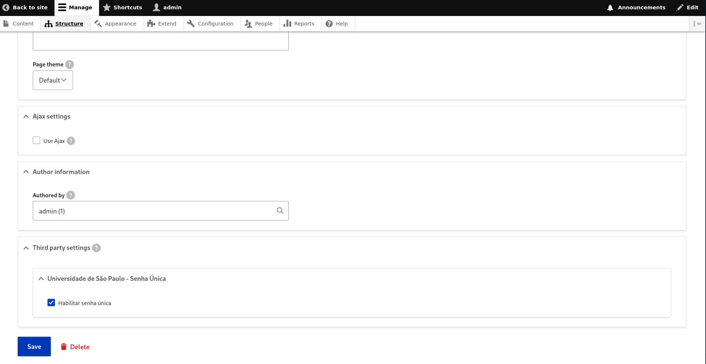
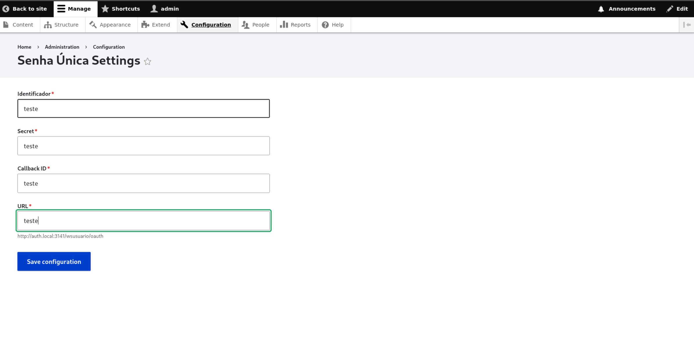

## Funcionalidade

O módulo permite restringir o acesso a um Webform para usuários autenticados pela Senha Única USP.

## Habilitando o módulo

Para habilitar a autenticação em um formulário:

1. Acesse **Structure → Webforms**.
2. Selecione o Webform desejado.
3. Acesse a aba **Settings**.
4. Localize **Third party settings → Universidade de São Paulo - Senha Única**.
5. Marque **Habilitar Senha Única**.
6. Salve o formulário.

## Configurando o módulo

Para configurar os parâmetros de autenticação:

1. Acesse **Configuration → System → Webform Senha Única - Settings**.
2. Preencha os campos de configuração.
3. Salve as alterações.

